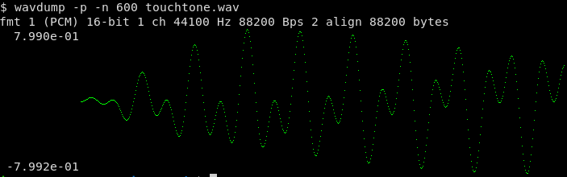

## wavdump
Display information from wav file

    Usage: wavdump [options] wavfile
    options:
      -e    print samples as floating point
      -f    plot FFT (length must be a power of 2)
      -l    print samples on one line (no pretty print)
      -n string
            range of samples to print/plot
            examples:
              100     first 100 samples
              50:100  50th thru 100th sample
              100:    from 100th sample to the end of the file
      -p    plot samples
      -r    plot RMS
      -s float
            plot log RMS, floor in dB (-40 dB)
    environment variables:
      WAVDUMP=term=iterm xres=800 yres=200    terminal graphics (iTerm2/mintty)
      WAVDUMP=nogfx    disable graphics (Kitty terminal)

```
$ wavdump tone.wav
tone.wav: fmt 1 (PCM) 16-bit 1 ch 44100 Hz 88200 Bps 2 align 88200 bytes [0:800]
```


